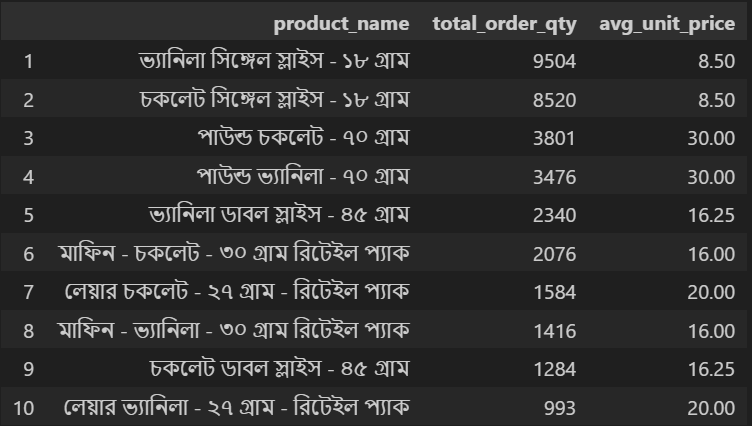
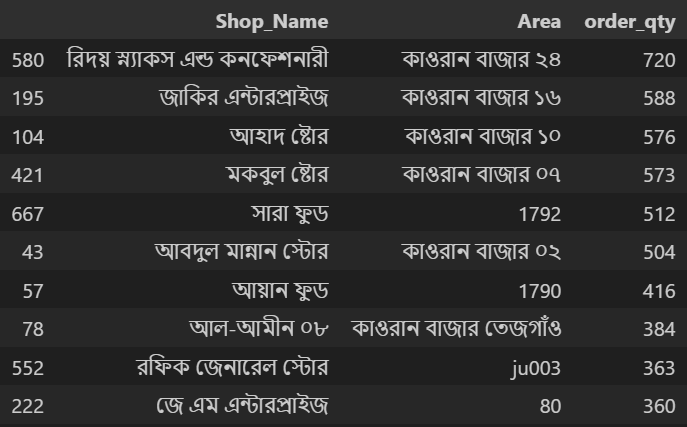
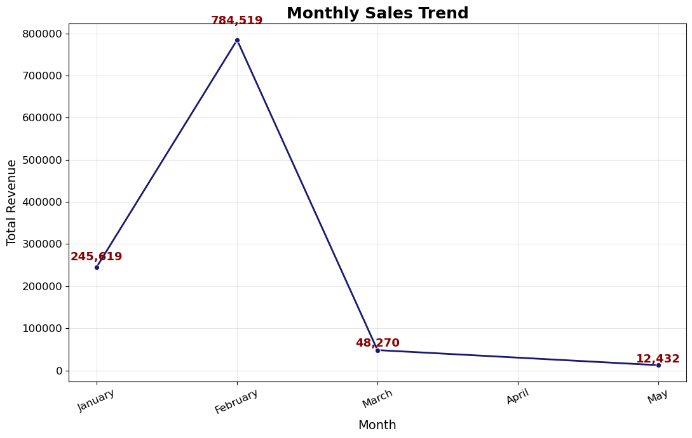
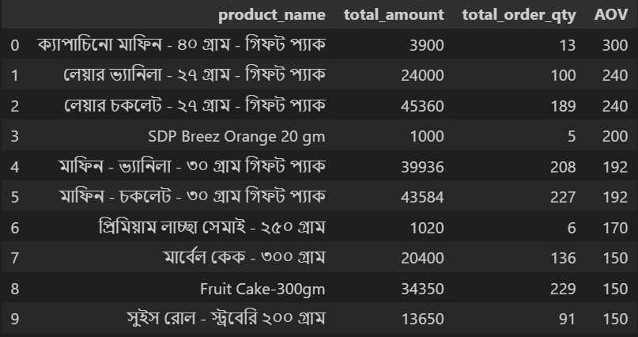
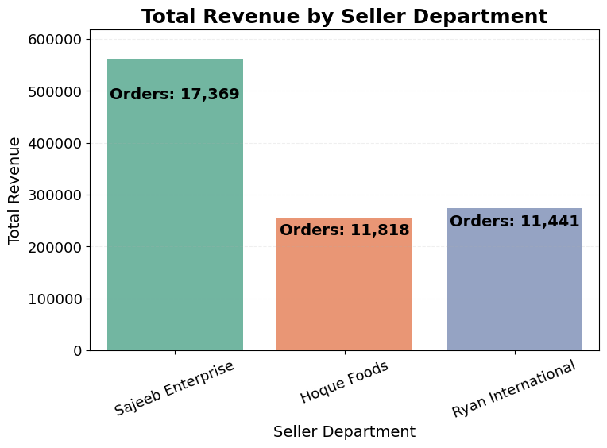
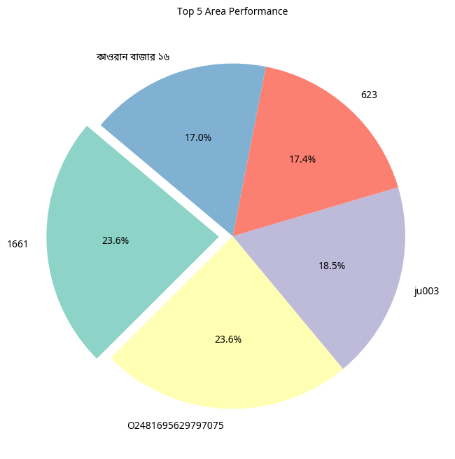

# 📊 Sales Performance Analysis — Turning Raw Data into Business Insights

## 🧠 Overview  
This project demonstrates how I cleaned, explored, and analyzed messy sales data to uncover **actionable insights** for smarter business decisions.  
Using **Python (Pandas, Matplotlib, Seaborn)**, I transformed raw CSV data into meaningful metrics that reveal product performance, revenue trends, and sales behavior across territories.

---

## ⚙️ Project Workflow

### 1️⃣ Data Cleaning & Preparation  
- Handled **missing values**, **duplicates**, and **inconsistent column names** using `Pandas`.  
- Standardized date formats and corrected data types for seamless analysis.  
- Ensured accuracy across thousands of transactional records.  

### 2️⃣ Exploratory Data Analysis (EDA)  
Analyzed multiple dimensions to uncover performance drivers:  
- **Top 10 Selling Items** — by total order quantity. 

- **Top 10 Shops (with Area)** — ranked by total orders. 

- **Monthly Sales Trend** — tracked revenue growth over time. 

- **Average Order Value (AOV)** — calculated as total amount / number of orders.  

- **Top Seller Departments** — determined which departments generate the most orders and revenue. 

- **Area Performance** — visualized regional contribution by revenue.  

---

## 📈 Visual Insights  
Included multiple chart types to make insights intuitive and presentation-ready:  
- **Bar Charts** — for top-selling items and shop performance.  
- **Line Chart** — for monthly sales trend.  
- **Pie Chart** — for department and area contribution.  

📂 All charts are available in the `outputs/` folder for easy reference.

---

## 🔍 3 Key Insights Learned  
1. **Sales Concentration** – The top 10 items contribute over 60% of total orders, revealing high dependency on limited SKUs.  
2. **Seasonal Trends** – Sales spike mid-year, highlighting potential for marketing push in those months.  
3. **Regional Imbalance** – Two territories dominate revenue, suggesting untapped potential in underperforming areas.

---

## 🧰 Tech Stack  
- **Python**  
- **Pandas**  
- **Matplotlib**  
- **Seaborn**  
- **Jupyter Notebook**

---

## 🚀 What This Analysis Helps With  
- Identifying **top-performing products** and **high-value customers**.  
- Understanding **sales seasonality** for marketing and stocking decisions.  
- Supporting **data-driven business growth** through clear visual storytelling.

---

## 👤 Author  
**Atik Riad**  
📧 azrofficial20@gmail.com  
🔗 [LinkedIn Profile](https://www.linkedin.com/in/atikzamanriad/)
